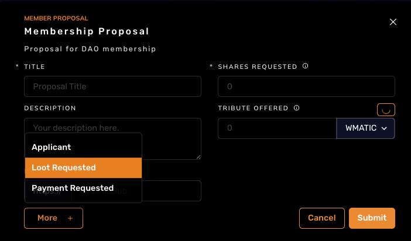

# Membership Proposal Process

## 1. Send tribute to the DAO Gnosis Safe

For tributes of either GHST or Land Parcels, please send to this address:

`0x8c3fB88A4B91A2bA45f5d1c3e6BFc7F97bFDB557`

This is the [DAO Gnosis Safe.](https://gnosis-safe.io/app/matic:0x8c3fB88A4B91A2bA45f5d1c3e6BFc7F97bFDB557/balances)

## 2. Create membership proposal

- Go to the [DAO Proposals Page](https://app.daohaus.club/dao/0x89/0xb60374ae550f6ab6d18e7c9cfafa04ff310235c1/proposals)
- Create a new membership proposal under "The Classics"  and request the correct amount of shares and loot

- Use the title "Member proposal for (your discord name)"
- In the description include the link to the transaction of your GHST and/or Land tribute
- Request exactly 1 share
- To request Loot click the "More +" button

- Click "Loot Requested"
- Include the Loot amount in the new "Loot Requested" box

- Leave the Tribute Offered box empty
- Click submit
